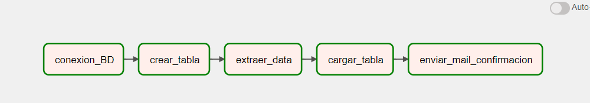

# cotizaciones_dolar_argentina
Proyecto de  Data Engineering

# Proyecto de Obtención de Cotizaciones del Dólar en Argentina

Este proyecto utiliza Python, Apache Airflow y Amazon Redshift para obtener y procesar las diferentes cotizaciones del dólar en Argentina. Proporciona una solución automatizada que te permite obtener de manera regular y confiable las tasas de cambio del dólar en el mercado argentino.

## Descripción

El objetivo principal de este proyecto es brindar una herramienta que facilite el seguimiento y análisis de las cotizaciones del dólar en Argentina. Utiliza Apache Airflow, una plataforma de orquestación de tareas, para programar y ejecutar de manera automatizada una serie de tareas relacionadas con la obtención de datos y su procesamiento.

## Tecnologías utilizadas

Este proyecto utiliza [Python](https://www.python.org/), [Apache Airflow](https://airflow.apache.org/) y [Amazon Redshift](https://aws.amazon.com/redshift/) para obtener y procesar las diferentes cotizaciones del dólar en Argentina. Proporciona una solución automatizada que te permite obtener de manera regular y confiable las tasas de cambio del dólar en el mercado argentino.

- [Python](https://www.python.org/): Lenguaje de programación utilizado para implementar las diferentes funcionalidades del proyecto.
- [Apache Airflow](https://airflow.apache.org/): Plataforma de orquestación de tareas utilizada para programar y ejecutar los flujos de trabajo.
- [Amazon Redshift](https://aws.amazon.com/redshift/): Servicio de almacenamiento y análisis de datos en la nube utilizado para almacenar y consultar las cotizaciones del dólar.
- Otros paquetes y bibliotecas de Python: Se utilizan diversas bibliotecas de Python, como requests, psycopg2, pandas, entre otras, para realizar las solicitudes de datos, la conexión a la base de datos y el procesamiento de los resultados.

## Funcionalidades principales

- **Obtención de datos**: El proyecto realiza solicitudes a fuentes confiables de cotizaciones del dólar en Argentina, obteniendo los datos más recientes.
- **Almacenamiento en Amazon Redshift**: Las cotizaciones del dólar se almacenan en una base de datos en Amazon Redshift, lo que permite un acceso rápido y eficiente a los datos.
- **Procesamiento y análisis**: Se realizan transformaciones y cálculos sobre los datos obtenidos para obtener métricas relevantes, como tasas de cambio promedio, variaciones porcentuales, entre otros.
- **Generación de informes**: Se generan informes automatizados con los resultados del procesamiento, brindando una visión clara y actualizada de las cotizaciones del dólar en Argentina.
- **Programación y automatización**: Utilizando Apache Airflow, se programan y ejecutan las tareas de obtención, procesamiento y generación de informes de forma automatizada y programada.

Este proyecto es una solución versátil y escalable que te permite obtener y analizar las cotizaciones del dólar en Argentina de manera eficiente y confiable. Puedes adaptarlo y personalizarlo según tus necesidades específicas y ampliarlo con funcionalidades adicionales si lo deseas.

# Tareas realizadas por el DAG

Aquí puedes agregar una descripción o detalles adicionales sobre las tareas realizadas por el DAG.

## Tareas del DAG

- `task_1`: Conexión a la base de datos - Esta tarea establece una conexión a la base de datos de Redshift. Utiliza la función `conexion_redshift` y recibe como argumento la fecha (`{{ ds }}`) y la hora de ejecución (`{{ execution_date.hour }}`).

- `task_2`: Crear tabla - Esta tarea crea una tabla en la base de datos. Utiliza la función `creacion_de_tablas`.

- `task_3`: Extraer datos - Esta tarea extrae datos de alguna fuente. Utiliza la función `extraer_data` y recibe como argumento la fecha (`{{ ds }}`) y la hora de ejecución (`{{ execution_date.hour }}`).

- `task_4`: Cargar tabla - Esta tarea carga los datos extraídos en la tabla previamente creada. Utiliza la función `cargar_datos` y recibe como argumento la fecha (`{{ ds }}`) y la hora de ejecución (`{{ execution_date.hour }}`).

- `task_5`: Enviar correo de confirmación - Esta tarea envía un correo electrónico de confirmación. Utiliza la función `enviar`.

